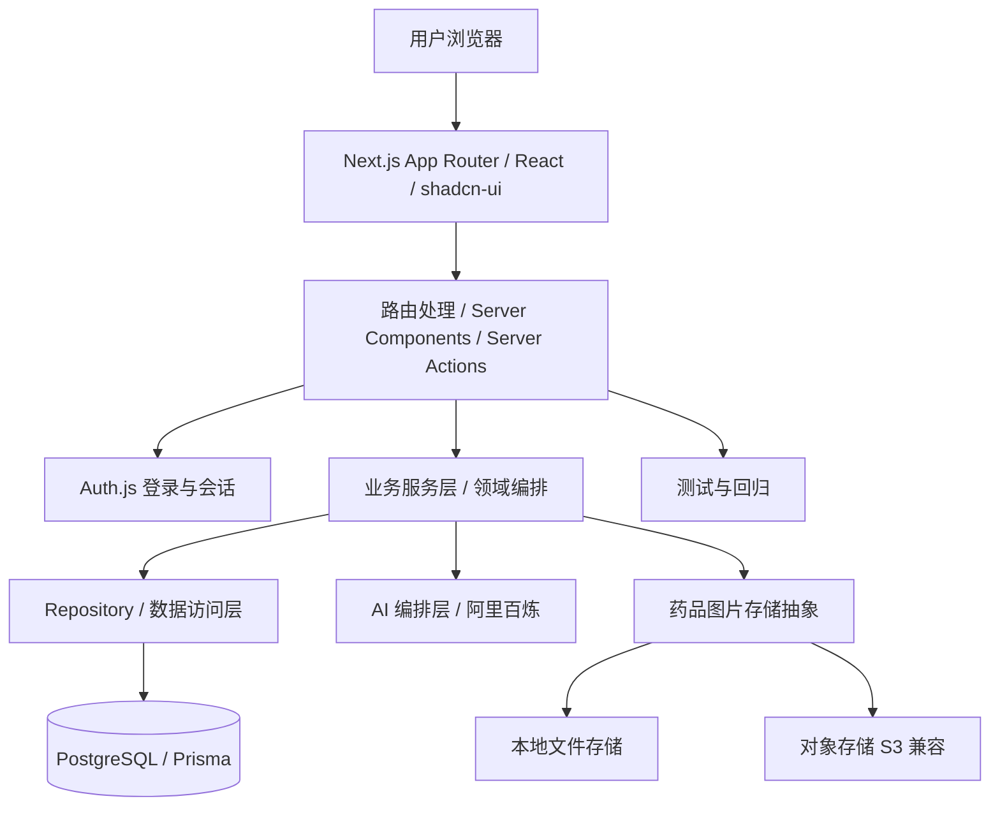
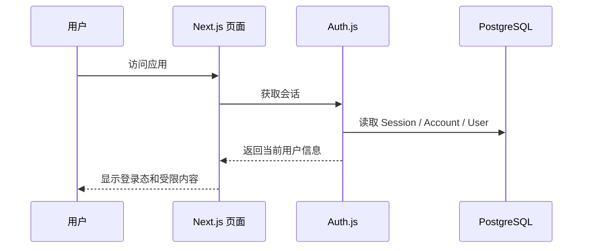
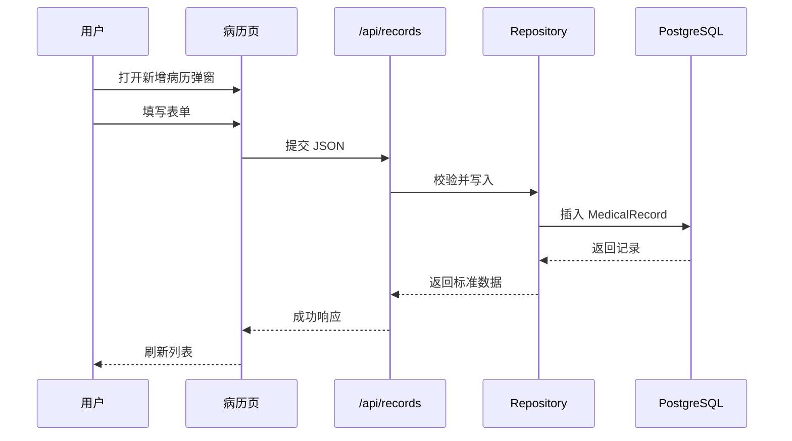
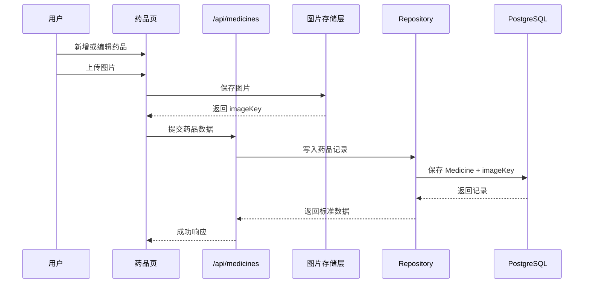
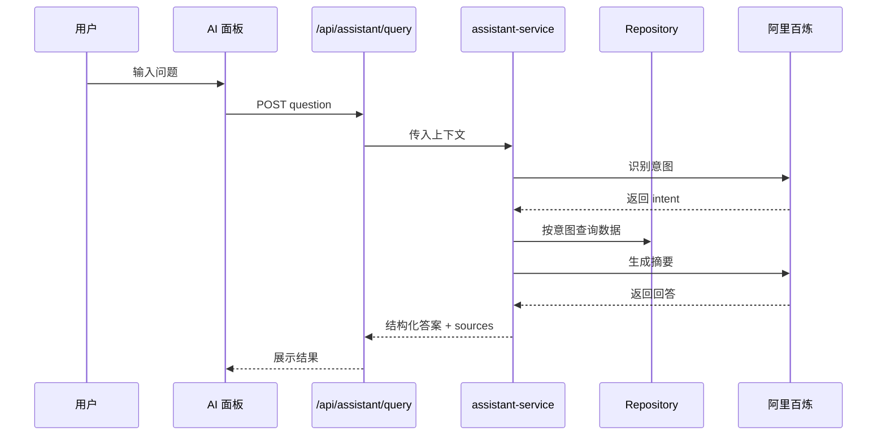

# AI Medicine Vault 架构设计文档

## 1. 文档目的

本文档用于说明 `AI Medicine Vault` 当前的系统架构、模块边界、数据流、权限模型和技术选型，并作为后续功能开发与重构的统一参考。

这个项目的定位不是医疗诊断工具，而是一个面向个人和家庭的健康资料记录站。它帮助用户把分散在病历、药品、过敏记录、就医准备清单里的信息集中管理起来，再借助 AI 做资料整理、问题归纳和上下文回顾。

## 2. 产品定位

### 2.1 核心目标

- 统一管理家庭成员的健康资料。
- 记录病历、药品、过敏史、就医准备等结构化信息。
- 支持基于真实数据的 AI 查询和摘要。
- 让用户在看医生或问药师前能快速整理上下文。
- 保持数据隔离、权限清晰和可追溯。

### 2.2 设计原则

- 以家庭为边界，而不是以单个页面为边界。
- 以结构化数据为主，AI 只做整理和归纳。
- 默认保守，不输出诊断、治疗或替代用药建议。
- 前端保持一个可演进的单体应用，避免过早拆服务。
- 所有外部能力都要有降级路径。

## 3. 当前实现概览

项目当前已经形成一套完整的单体架构：

- **前端层**：Next.js App Router + React 19 + TypeScript + shadcn/ui
- **业务层**：`features/medicine-vault/` 下的领域逻辑、仓库、路由、AI 编排
- **数据层**：Prisma + PostgreSQL
- **认证层**：Auth.js v5 + Prisma Adapter
- **AI 层**：阿里百炼模型调用，负责意图识别、上下文整理和摘要
- **图片层**：药品图片本地落盘抽象 + S3 兼容对象存储后端
- **测试层**：Node 单测 + Playwright E2E + GitHub Actions CI

系统目前不是微服务拆分形态，而是一个边界清晰的全栈应用。这样做的好处是迭代快、排障简单、部署成本低，也适合当前阶段的家庭资料管理场景。

## 4. 总体架构



### 4.1 架构判断

当前选择的是“**单体应用 + 领域分层**”路线，而不是前后端完全拆分：

- 前端、页面和 API 共享代码，迭代效率高。
- 数据模型、仓库、AI 编排都在同一个仓库中，方便追踪。
- 权限校验和数据隔离可以统一在服务层和仓库层做。
- 后续如果确实要拆服务，可以先拆 AI、文件处理或异步任务，不需要动核心数据模型。

## 5. 分层设计

### 5.1 展示层

位置：

- `app/`
- `components/medicine-vault/`
- `components/ui/`

职责：

- 渲染首页、成员、病历、药品、过敏、就医准备和 AI 助手页面。
- 承担用户交互、筛选、弹窗、分页和详情展示。
- 通过 Server Components 优先走服务端渲染，减少客户端状态复杂度。

约束：

- 路由文件只负责编排，避免写重业务逻辑。
- 复杂 UI 下沉到 `components/medicine-vault/`。
- 通用基础组件只放在 `components/ui/`。

### 5.2 业务层

位置：

- `features/medicine-vault/`

职责：

- 定义领域数据类型。
- 定义表单 schema 和输入校验。
- 定义仓库操作和权限边界。
- 定义 AI 意图识别、候选匹配和兜底逻辑。
- 定义药品图片存储、回填和状态判断。

这是项目最重要的一层。页面不应该直接操作数据库，也不应该把 AI 逻辑写散在各个 route 里。

### 5.3 数据访问层

位置：

- `features/medicine-vault/repository.ts`
- `prisma/schema.prisma`

职责：

- 封装 Prisma 查询。
- 将数据库实体映射为前端和业务层需要的结构。
- 保证同一用户数据隔离。
- 管理分页、筛选、排序和写入逻辑。

设计原则：

- 页面不直接访问 Prisma。
- repository 做“真实数据库”和“领域对象”之间的适配。
- 所有按成员、按用户过滤的逻辑都尽量放在仓库层，而不是页面层。

### 5.4 认证与权限层

位置：

- `features/medicine-vault/auth-context.ts`
- `app/api/auth/[...nextauth]`
- `app/login`
- `proxy.ts` / 中间件边界

职责：

- 识别当前登录用户。
- 提供 `RepositoryContext`。
- 拦截未登录用户访问核心页面和 API。
- 绑定用户级数据隔离。

权限判断原则：

- 用户只能访问自己的成员、病历、药品和过敏记录。
- 写接口必须校验当前用户身份。
- 详情接口必须先判断归属。
- 导出接口不能跨用户。

### 5.5 AI 编排层

位置：

- `features/medicine-vault/assistant-routing.ts`
- `features/medicine-vault/assistant-service.ts`
- `app/api/assistant/query/route.ts`

职责：

- 识别用户问题属于哪个意图。
- 从数据库中找出对应记录。
- 组织来源依据。
- 调用大模型生成简洁、可解释的答案。
- 在模型失败时提供本地兜底答案。

当前已支持的意图包括：

- 感冒记录
- 过敏记录
- 用药说明
- 药物相互作用
- 过期药处理
- 药品查询
- 就医准备
- 未支持问题兜底

AI 层的设计原则是“**先路由，再检索，再摘要**”，而不是直接让模型自由生成回答。

### 5.6 图片存储层

位置：

- `features/medicine-vault/medicine-image-storage.ts`
- `features/medicine-vault/medicine-image-backfill.ts`

职责：

- 保存药品图片。
- 支持本地文件存储与 S3 兼容对象存储。
- 兼容历史 `imageBytes` 数据。
- 为旧数据提供回填脚本。

设计原因：

- 图片不适合长期只塞进数据库。
- 通过存储抽象，后续切换 OSS / R2 / S3 时不需要改业务代码。

## 6. 核心数据流

### 6.1 登录与身份流



要点：

- 登录态由 Auth.js 维护。
- 页面和 API 使用同一套 `RepositoryContext`。
- 没有会话时，核心页面不会直接开放给匿名用户。

### 6.2 病历录入与展示流



病历当前重点保存：

- 就诊日期
- 医院与科室
- 诊断结论
- 诊疗摘要
- 检查/检验结果
- 症状描述
- 复诊时间
- 医生建议
- 处方备注

### 6.3 药品管理流



药品模块还负责：

- 分类筛选
- 分页
- 有效期状态
- 库存状态
- 详情页
- 删除时的图片清理

### 6.4 AI 问答流



如果 AI 调用失败：

- 先走本地兜底路由。
- 再返回固定友好提示。
- 不把内部报错直接暴露给用户。

## 7. 数据模型

### 7.1 用户模型

`User` 是所有业务数据的根。

关联表：

- `Account`
- `Session`
- `Member`
- `MedicalRecord`
- `Medicine`
- `AllergyRecord`
- `VisitPreparation`
- `AiCallLog`

### 7.2 成员模型

`Member` 表示家庭里的一个健康档案主体，可以是本人、父母、孩子或其他家庭成员。

字段重点：

- 姓名
- 关系
- 出生年份
- 性别
- 过敏摘要
- 健康备注

### 7.3 病历模型

`MedicalRecord` 目前用于承载就诊过程中的关键上下文。

字段重点：

- 就诊日期
- 医院
- 科室
- 症状
- 诊断
- 诊疗摘要
- 检查/检验结果
- 复诊时间
- 医生建议
- 处方备注

### 7.4 药品模型

`Medicine` 是家庭药箱的主记录。

字段重点：

- 药品名称
- 分类
- 剂量
- 规格
- 数量
- 有效期
- 存放位置
- 使用说明
- 适应症
- 安全提示
- 图片信息

### 7.5 过敏模型

`AllergyRecord` 用来记录明确或疑似过敏和不良反应。

### 7.6 就医准备模型

`VisitPreparation` 用来把历史数据整理成可带去问诊的摘要。

### 7.7 AI 调用日志

`AiCallLog` 用于记录 AI 路由、模型、成功与失败状态、输入输出大小和错误信息，方便后续排障和成本审计。

## 8. 关键模块说明

### 8.1 首页工作台

首页不是营销页，而是工作台：

- 展示统计卡片。
- 展示最近病历。
- 展示就医准备清单。
- 提供快速入口到成员、病历、药品和 AI 助手。

### 8.2 成员详情页

成员详情页是一个家庭资料中枢：

- 聚合病历、药品、过敏、就医准备。
- 提供成员编辑与删除。
- 作为 AI 查询时的上下文入口。

### 8.3 病历记录页

病历页按时间线展示就诊记录，并支持录入原型。

当前设计更偏“长期整理”，不是单纯的门诊流水表。

### 8.4 药品页与药品详情页

药品页负责列表、搜索、筛选、分页和风险状态。

药品详情页负责：

- 展示单条药品完整信息
- 放大查看图片
- 编辑和删除
- 显示有效期和库存状态

### 8.5 AI 助手页

AI 助手页采用“意图路由模式”：

- 先判断用户在问什么。
- 再查对应数据。
- 最后生成有依据的回答。

这个设计比“纯聊天”更稳，更适合当前项目。

## 9. 安全与边界

### 9.1 医疗边界

系统不做：

- 诊断
- 治疗建议
- 处方替代
- 药物替代推荐

系统只做：

- 信息整理
- 记录回顾
- 上下文摘要
- 问诊准备
- 来源提示

### 9.2 数据边界

- 所有业务数据都绑定 `userId`。
- 任何写操作都要校验归属。
- 导出不能跨用户。
- 图片和附件不能脱离权限边界。

### 9.3 AI 边界

- AI 回答必须尽量带来源。
- 不能识别时直接兜底。
- 超长输入要拒绝。
- AI 失败时不能让页面崩溃。

## 10. 测试与验证

当前验证体系分三层：

### 10.1 单元测试

覆盖：

- 意图识别
- 数据匹配
- 导出逻辑
- 安全校验
- 图片存储抽象

### 10.2 构建校验

`npm run build` 用于验证：

- 页面编译
- TypeScript 类型
- 路由生成
- 服务端代码兼容性

### 10.3 E2E 回归

Playwright 用于覆盖：

- 登录
- 药品新增编辑删除
- 图片展示
- AI 问答
- 导出

## 11. 部署与运行

### 11.1 本地开发

- `npm install`
- `npm run db:up`
- `npx prisma migrate dev`
- `npm run dev`

### 11.2 生产部署

生产环境至少需要：

- `DATABASE_URL`
- `AUTH_SECRET`
- `AUTH_GITHUB_ID`
- `AUTH_GITHUB_SECRET`
- `DASHSCOPE_API_KEY`
- 图片存储相关环境变量

### 11.3 持续集成

CI 已覆盖：

- Prisma 校验
- 单测
- 构建
- E2E

## 12. 架构演进方向

后续如果项目继续增长，优先演进的方向是：

1. 更完整的病历结构化。
2. 提醒中心。
3. 家庭协作与权限分级。
4. 更丰富的 AI 意图和检索能力。
5. 上传附件和报告管理。
6. 更稳的生产监控与告警。

## 13. 目录建议

```text
app/                         页面与路由
components/medicine-vault/    领域 UI 组件
components/ui/                基础 UI 组件
features/medicine-vault/      业务逻辑、仓库、AI、存储
lib/                          工具函数与基础设施
prisma/                       数据模型与迁移
docs/                        架构、路线图和任务文档
```

## 14. 结语

AI Medicine Vault 当前已经具备一个可继续扩展的健康资料工作台雏形。它的核心不是“让 AI 替你判断”，而是“让 AI 帮你把自己的健康资料整理清楚”。

只要继续守住三个原则：

- 资料结构化
- 权限边界清晰
- AI 只做资料整理

这个项目就能在不失控的前提下，持续往家庭健康资料中枢演进。
